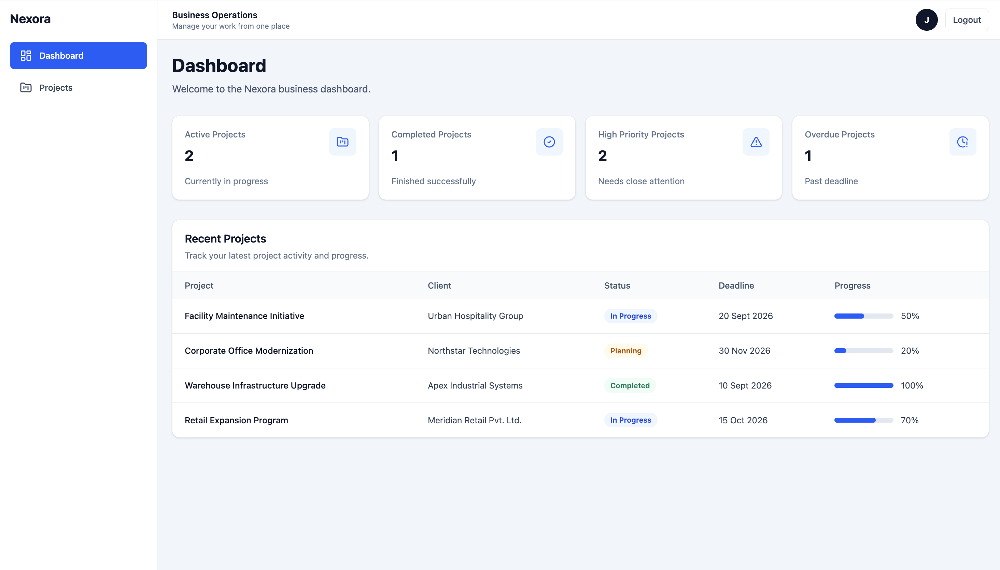
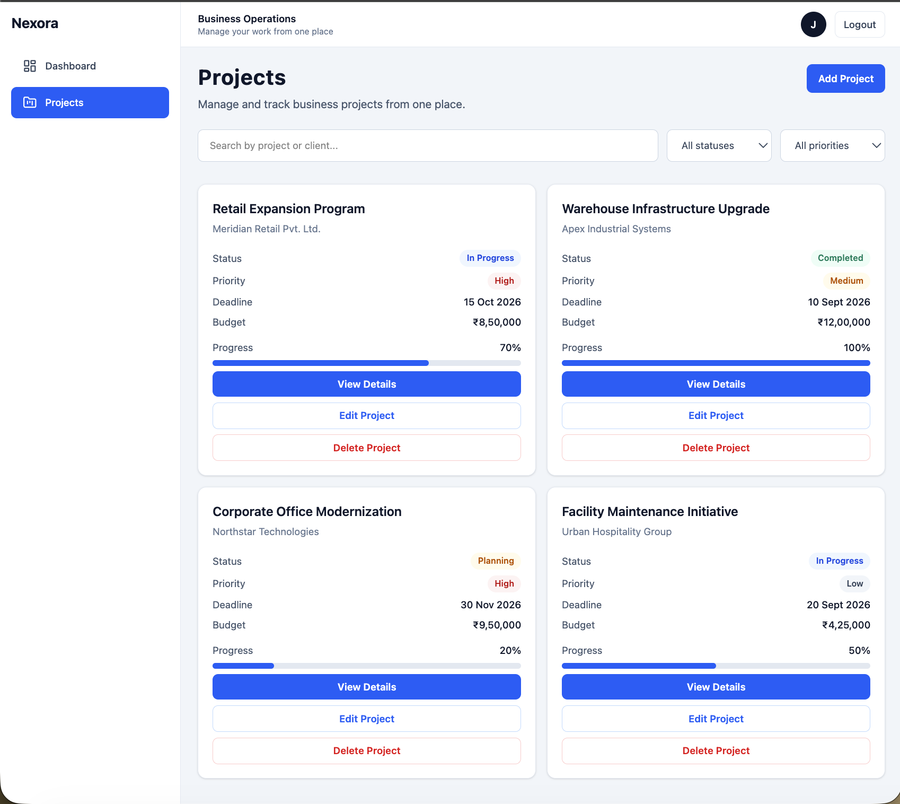
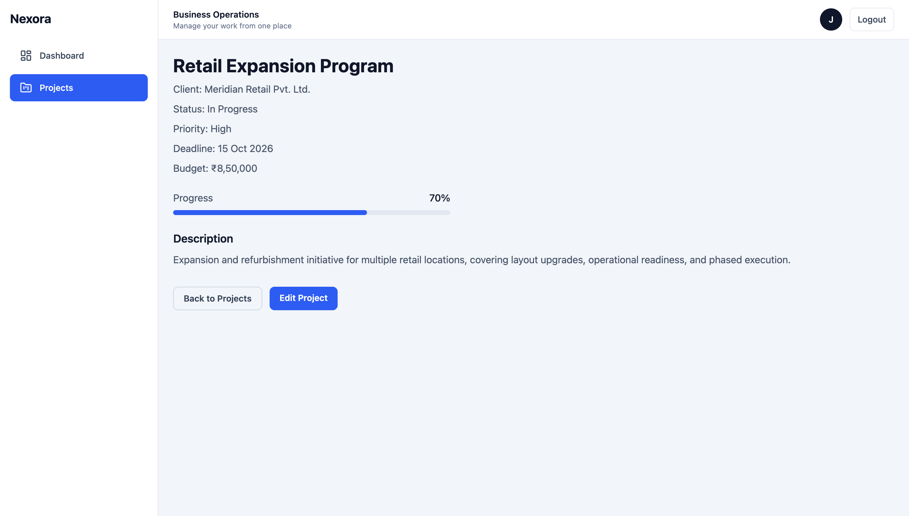

# Nexora Business OS

Nexora Business OS is a full-stack project management platform built with React, Node.js, Express, and MongoDB.

It provides secure authentication, project lifecycle management, priority and status tracking, dashboard insights, filtering, and production-oriented engineering practices including automated testing, CI/CD, and cloud deployment.

## Live Demo

- **Web Application:** [Open Nexora Business OS](https://nexora-web-v8fa.onrender.com)
- **API Health:** [Check API Status](https://nexora-api-hw00.onrender.com/api/health)

## Product Preview

### Dashboard

Overview of active, completed, high-priority, and overdue projects with recent project activity and progress tracking.



### Project Management

Search, filter, track, update, and manage projects with status, priority, deadlines, budgets, and progress.



### Project Details

Detailed project view with client information, status, priority, deadline, budget, progress, and description.



## Key Features

- Secure user authentication with protected routes and HTTP-only cookie-based sessions
- Full project lifecycle management: create, view, update, and delete projects
- Project status, priority, and progress tracking
- Search, status filtering, and priority filtering
- Dashboard metrics for active, completed, high-priority, and overdue projects
- Recent projects overview with progress tracking and formatted deadlines
- User-scoped project access to keep project data isolated per account
- Backend validation and automated API test coverage
- Frontend component and page testing with Vitest and React Testing Library
- CI/CD checks for linting, testing, and production builds
- Cloud deployment for both frontend and backend

## Tech Stack

| Layer          | Technologies                                                  |
| -------------- | ------------------------------------------------------------- |
| Frontend       | React, Vite, Tailwind CSS, React Router, Lucide React         |
| Backend        | Node.js, Express.js                                           |
| Database       | MongoDB, Mongoose                                             |
| Authentication | JWT, HTTP-only cookies                                        |
| Testing        | Vitest, React Testing Library, Node.js Test Runner, Supertest |
| DevOps         | GitHub Actions, Render                                        |
| Tooling        | ESLint, npm, Git, GitHub                                      |

## Architecture

Nexora follows a separated frontend-backend architecture with clear responsibility boundaries.

```text
React + Vite Frontend
        ↓
REST API Requests
        ↓
Node.js + Express Backend
        ↓
Mongoose
        ↓
MongoDB
```

## Testing & CI/CD

### Automated Testing

The project includes automated coverage for critical frontend and backend flows.

- Backend API tests cover authentication, project CRUD, ownership isolation, validation, and health checks
- Frontend tests cover authentication flows, protected routing, dashboard metric calculations, and project validation rules
- Supertest is used for backend HTTP integration testing
- Vitest and React Testing Library are used for frontend testing

### Continuous Integration

GitHub Actions runs automated checks on pull requests and pushes.

The CI pipeline verifies:

- Frontend linting
- Frontend tests
- Frontend production build
- Backend syntax validation
- Backend API tests

Changes are merged into `main` only after the required CI checks pass.

## Security & Production Readiness

Nexora includes several safeguards for authentication, data isolation, and production configuration.

- JWT authentication stored in HTTP-only cookies
- Production cookies configured with secure browser settings
- Protected backend routes for authenticated users
- User-scoped project queries to prevent cross-account project access
- Project ownership cannot be reassigned through update requests
- CORS configured for the deployed frontend origin
- Sensitive configuration managed through environment variables
- Production startup validation for required environment variables
- Dependency security auditing with patched known vulnerabilities
- API health endpoint for deployment monitoring
- Separate application and server startup structure for improved testability and deployment

## Project Structure

```text
nexora-business-os/
├── backend/
│   ├── config/
│   ├── controllers/
│   ├── middleware/
│   ├── models/
│   ├── routes/
│   ├── tests/
│   ├── app.js
│   └── server.js
│
├── frontend/
│   ├── src/
│   │   ├── components/
│   │   ├── context/
│   │   ├── hooks/
│   │   ├── layouts/
│   │   ├── pages/
│   │   ├── test/
│   │   └── utils/
│   └── vite.config.js
│
└── .github/
    └── workflows/
```

## Run Locally

### Prerequisites

- Node.js and npm
- A MongoDB connection string

### 1. Clone the repository

```bash
git clone https://github.com/Jayeeeesh/nexora-business-os.git
cd nexora-business-os
```

### 2. Configure and run the backend

```bash
cd backend
npm ci
cp .env.example .env
```

Update `.env` with your local configuration:

```env
MONGO_URI=your_mongodb_connection_string
JWT_SECRET=replace_with_a_long_random_secret
CLIENT_URL=http://localhost:5173
PORT=5001
NODE_ENV=development
```

Start the backend:

```bash
npm run dev
```

The API will run at:

```text
http://localhost:5001
```

### 3. Configure and run the frontend

Open a second terminal from the repository root:

```bash
cd frontend
npm ci
cp .env.example .env.local
```

Configure the frontend API URL:

```env
VITE_API_URL=http://localhost:5001
```

Start the frontend:

```bash
npm run dev
```

Vite will display the local application URL, typically:

```text
http://localhost:5173
```

### 4. Run automated tests

Backend:

```bash
cd backend
npm test
```

Frontend:

```bash
cd frontend
npm run test:run
```

### 5. Run frontend quality checks

```bash
cd frontend
npm run lint
npm run build
```
